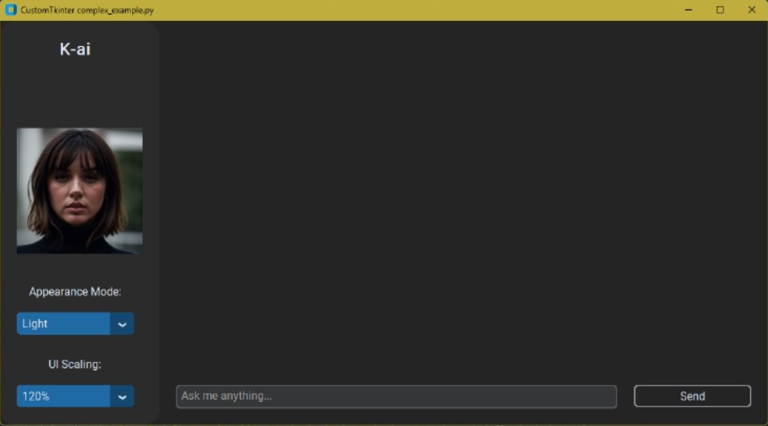

# k-ai
### k-ai is an Artificial Intelligence Project with Bark, Mistral, and NLTK

This project leverages the Bark, Mistral, and NLTK libraries to implement artificial intelligence functionalities. These libraries enable natural language processing (NLP) and the construction of machine learning models.

## Installation

Before getting started, ensure you have `Python` and `pip` installed in your environment
- Install [ollama] ([https://duckduckgo.com](https://ollama.com/download)).
- Pull mistral model 
  ```bash
  ollama run mistral
  ```
- Install bark from suno ai
  ```bash
  git clone https://github.com/suno-ai/bark
  cd bark && pip install . 
  ```
- Run the following command to install the project dependencies
  ```bash
  pip install -r requirements.txt
  ```



> [!WARNING]
> To use this project, I recomend using a GPU with 8 or more space of vram

> [!CAUTION]
> Make sure you have at least 50GB of space
## Low performance?
- The full version of Bark requires around 12Gb of memory to hold everything on GPU at the same time. If you have a lowey GPU add the following code snippet before your generation:
  ```bash
  import os
  os.environ["SUNO_OFFLOAD_CPU"] = "True"
  os.environ["SUNO_USE_SMALL_MODELS"] = "True"
  ```
